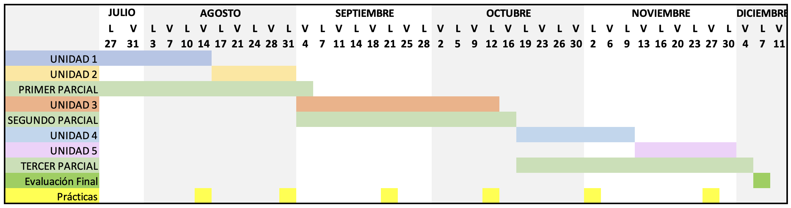

# PLAN DE ASIGNATURA

## INF 661 — PROGRAMACIÓN Y ANIMACIÓN DIGITAL

**Marco referencial:** El programa docente del proceso de enseñanza-aprendizaje se encuentra estructurado en correspondencia con los lineamientos del modelo académico. La asignatura contribuye al fortalecimiento de la familia laboral "Ingeniería de Software", así como al perfil definido en el proyecto curricular.

La materia "Programación y Animación Digital" tiene como propósito la formación en el diseño y desarrollo de contenidos digitales interactivos, integrando conocimientos de programación con técnicas de animación. Se busca que el estudiante adquiera competencias en el uso de herramientas de animación digital, principios básicos del movimiento y narración visual, así como en la aplicación de lenguajes y entornos de programación orientados a la creación de experiencias dinámicas. Para ello, se abordan fundamentos de lógica de programación, estructuras de control, manipulación de gráficos y animación cuadro a cuadro, con el fin de producir soluciones digitales creativas, funcionales y adaptadas a diversos contextos educativos, recreativos y profesionales.

---

## I. IDENTIFICACIÓN DE LA ASIGNATURA

| Campo | Detalle | Campo | Detalle |
|---|---|---|---|
| **Facultad:** | Ciencias Puras | **Carrera:** | Ingeniería Informática |
| **Asignatura:** | Programación y Animación Digital | **Sigla y código:** | INF 661 |
| **Pre-Requisito:** | INF 520 | **Total de horas:** | 5 horas/semana |
| **Trabajo Independiente semanal:** | 5 horas | **Número de créditos:** | 5 |
| **Horas teóricas:**   **Horas prácticas:**   **Horas laboratorio:** | 0   0   5 | **Semestre:** | Sexto Semestre   (Mención Ingeniería de Software) |
| **Docente:** | M. Sc. Huáscar Fedor Gonzales Guzmán | **Email:** | huascar.fedor@gmail.com |

---

## II. FUNDAMENTACIÓN Y JUSTIFICACIÓN

La asignatura Programación y Animación Digital se fundamenta en la necesidad de integrar conocimientos de programación con técnicas de animación para la creación de contenidos interactivos y dinámicos. En un contexto en el que la comunicación visual y el desarrollo de entornos digitales adquieren creciente relevancia, la materia aporta a la formación de profesionales capaces de diseñar, implementar y evaluar recursos que combinan lógica computacional con creatividad gráfica.

El propósito de la asignatura es proporcionar a los estudiantes las bases conceptuales y prácticas que les permitan comprender los principios de la animación digital, la lógica de programación y su articulación en la construcción de proyectos funcionales, accesibles y atractivos. A través de este enfoque, se promueve el desarrollo de competencias orientadas a la solución de problemas, el diseño de experiencias interactivas y la producción de contenidos innovadores aplicables en diversos ámbitos como la educación, el entretenimiento, la comunicación y la industria creativa.

De esta manera, la asignatura se convierte en un espacio formativo clave para vincular los aspectos técnicos de la programación con la expresión artística de la animación, contribuyendo a la formación integral de profesionales que combinan pensamiento lógico, creatividad y dominio tecnológico.

---

## III. PROPÓSITO

- Formar profesionales integrales con principios éticos y un proyecto de vida sólido.
- Dotar a los estudiantes de competencias académicas y profesionales que les permitan desarrollarse de manera eficiente, responsable y con compromiso social.
- Desarrollar habilidades y destrezas para la resolución de problemas propios de su área de conocimiento y para la toma de decisiones fundamentadas.
- Fomentar la competencia investigativa y la capacidad de análisis crítico para contribuir a la solución de problemas y necesidades de su contexto.
- Estimular la creatividad y la innovación en el diseño de soluciones digitales interactivas.
- Promover el aprendizaje autónomo y el uso responsable de tecnologías digitales para la producción de contenidos.
- Fomentar la colaboración y el trabajo en equipo en proyectos de desarrollo y animación digital.

---

## IV. COMPETENCIAS DE LA ASIGNATURA

### 4.1. Competencia Global de la Asignatura

Diseña, desarrolla y evalúa contenidos digitales interactivos aplicando principios de programación y fundamentos de animación digital, integrando aspectos técnicos y creativos para producir soluciones funcionales, atractivas y orientadas a las necesidades del usuario, fomentando la innovación, la usabilidad y la experiencia interactiva en diversos contextos.

### 4.2. Competencias Específicas de la Asignatura

- Comprende y aplica los principios de programación para estructurar y organizar la lógica de proyectos digitales interactivos.
- Diseña y produce animaciones digitales utilizando técnicas de movimiento, secuencias y narrativas visuales que mejoren la experiencia del usuario.
- Integra elementos gráficos y programáticos en proyectos interactivos, asegurando funcionalidad, coherencia visual y consistencia en la experiencia digital.
- Analiza y resuelve problemas relacionados con el desarrollo digital, aplicando pensamiento lógico y creativo para optimizar soluciones interactivas.
- Evalúa la usabilidad y la efectividad de los contenidos digitales, identificando oportunidades de mejora en la interacción y el diseño.
- Fomenta la innovación y la creatividad en la creación de soluciones digitales adaptadas a distintos contextos educativos, recreativos o profesionales.
- Aplica buenas prácticas de trabajo colaborativo en proyectos de desarrollo y animación digital, considerando aspectos éticos, responsables y de gestión de recursos.

---

## V. DESARROLLO DE SABERES DE LA ASIGNATURA

| Saber conocer | Saber hacer | Saber ser |
|---|---|---|
| - Conoce los principios de programación aplicables a proyectos digitales interactivos. - Conoce fundamentos de animación digital, incluyendo movimiento, secuencias y narrativa visual. - Conoce los elementos de calidad, usabilidad y experiencia del usuario en contenidos digitales interactivos. | - Aplica la lógica de programación para estructurar y desarrollar proyectos interactivos. - Diseña y produce animaciones digitales coherentes, funcionales y visualmente atractivas. - Evalúa la efectividad y usabilidad de contenidos digitales, identificando oportunidades de mejora. | - Creativo e innovador en la generación de soluciones digitales. - Analítico y resolutivo en la identificación de problemas y optimización de proyectos. - Colaborativo y proactivo en el trabajo en equipo. - Responsable y ético en el uso de tecnologías digitales. - Capacidad de planificación y organización en el desarrollo de proyectos. |

---

## VI. CONTENIDOS TEMÁTICOS DE LA ASIGNATURA

### UNIDAD 1: FUNDAMENTOS DE ANIMACIÓN 2D

- Interfaz de animación digital: timeline, capas y herramientas básicas
- Técnicas de dibujo digital: pluma, pincel, colores y capas
- Animación cuadro a cuadro: ciclos básicos (parpadeo, ola, caminata)
- Interpolaciones: motion tween, shape tween, color tween

### UNIDAD 2: ESCENARIOS E INTERACTIVIDAD BÁSICA

- Fondos y escenarios: scrolls, cámaras y composición de escenas
- Introducción a la programación en animación digital
- Eventos e interactividad: teclado, mouse y respuesta a acciones del usuario
- Simulación de física simple: velocidad, gravedad y colisiones

### UNIDAD 3: ANIMACIÓN PARA JUEGOS 2D

- Manejo de sprites y spritesheets para animación de personajes
- Integración de audio y sincronización con animaciones
- Animación de interfaces: botones, menús y transiciones
- Diseño y programación de minijuegos simples

### UNIDAD 4: ANIMACIÓN AVANZADA Y OPTIMIZACIÓN 2D

- Narrativa visual: storyboard y guion gráfico
- Animación compleja de personajes: ciclos, expresiones y acciones
- Efectos visuales: filtros, máscaras y partículas simples
- Exportación y optimización de proyectos: formatos GIF, MP4, Canvas y spritesheets

### UNIDAD 5: DISEÑO Y DESARROLLO FINAL

- Diseño del proyecto final: propuesta y storyboard
- Producción: creación de personajes, escenarios, animación, interactividad y audio
- Integración y presentación final del proyecto completo: corto animado o minijuego 2D

---

## VII. MÉTODOS Y ESTRATEGIAS DE ENSEÑANZA-APRENDIZAJE

Se utilizan métodos y estrategias de enseñanza y aprendizaje de acuerdo con el avance de la ciencia y la tecnología educativa y las necesidades de desarrollo de habilidades y destrezas.

- Explicativo ilustrativo
- Aprendizaje participativo
- Método problémico
- Método expositivo
- Simulación de casos
- Método investigativo
- Lluvia de ideas
- Aprendizaje por proyectos

### RECURSOS

- Computadora
- Data display
- Pizarra
- Texto base
- Guías de laboratorio
- Internet
- Plataforma de aprendizaje en línea, oficial de la UATF o Carrera
- Herramienta de comunicación virtual sincrónica (Zoom, Meet, Webex, otro)

### RECURSOS DE LABORATORIO

- Adobe Animate

---

## VIII. SISTEMA DE EVALUACIÓN

### Criterios de Evaluación — Asignatura de Laboratorio

| Componente | Ponderación |
|---|---|
| Exámenes parciales | 30% |
| Prácticas | 10% |
| Laboratorio | 30% |
| Examen final | 30% |
| **Total** | **100%** |

| Tipo de evaluación | Técnica | Instrumento | Evidencia | Entorno |
|---|---|---|---|---|
| **Diagnóstica** | Interrogatorio (presencial y/o virtual) | Guía de observación (presencial y/o virtual) | Cuestionario resuelto (presencial y/o virtual) | Aula (presencial y/o virtual) |
| **Formativa** | Desempeño (presencial y/o virtual) | Prueba escrita (presencial y/o virtual) | Presentación, exposición (presencial y/o virtual) | Aula (presencial y/o virtual) |
| **Sumativa / Producto** | Enunciado, ejercicios (presencial y/o virtual) | Prueba escrita (presencial y/o virtual) | Presentación de trabajo final (presencial y/o virtual) | Aula (presencial y/o virtual) |

---

## IX. BIBLIOGRAFÍA

- Díaz, C. (2020). *Narrativa visual para animadores*. Ediciones Creativas.
- Fernández, P. (2022). *Diseño de interfaces: Principios y prácticas*. Ediciones UX.
- García, L., & Rodríguez, F. (2022). *Animación digital: Interpolaciones y técnicas avanzadas*. Editorial Animarte.
- González, E. (2021). *Storyboarding para animación: Guía práctica*. Editorial Animarte.
- Herrera, M. (2022). *Programación de minijuegos interactivos*. Editorial Ludus.
- López, A. (2023). *Introducción a la programación para animación digital*. Ediciones Tecnológicas.
- Martínez, R. (2021). *JavaScript para animadores: Creando interactividad en la web*. Editorial WebPro.
- Pérez, M. (2020). *Dibujo digital para principiantes: Herramientas y técnicas*. Ediciones Digitales.
- Ramírez, J. (2023). *Desarrollo de juegos 2D: De la idea al código*. Ediciones GameDev.
- Smith, J. (2021). *Fundamentos de la animación 2D: Teoría y práctica*. Editorial Creativa.
- Torres, S. (2023). *Experiencia de usuario en aplicaciones interactivas*. Editorial Interactiva.

---

## X. CRONOGRAMA

